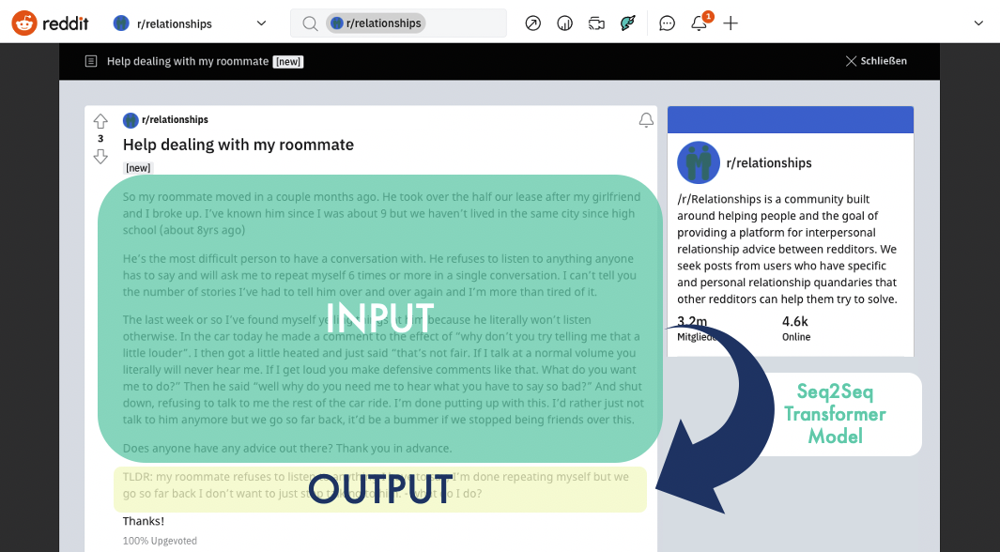

# Generating TL;DRs with the help of machine learning!

Natural Language Processing project as part of my experiential semester.  

The goal of the project is to teach a machine learning model how to generate "TL;DR"s (Summarizations) for stories of the [subreddit "relationships"](www.reddit.com/r/relationships).  

The project is divided into different parts:  

* [data_scarper.py](data_scarper.py): Python app to scrape data from reddit
* [data_merge.ipynb](data_merge.ipynb): Merging the scraped data with an open source dataset to enlarge the number of observations
* [data_clean_and_viz.ipynb](data_clean_and_viz.ipynb): Analysing, cleaning and visualizatio of the dataset
* [modelling.ipynb](modelling.ipynb): Fine-tuning the t5-small Transformer model with huggingface and Pytorch
* [evaluation.ipynb](evaluation.ipynb): Evaluating the models' performance and trying to understand its behaviour
